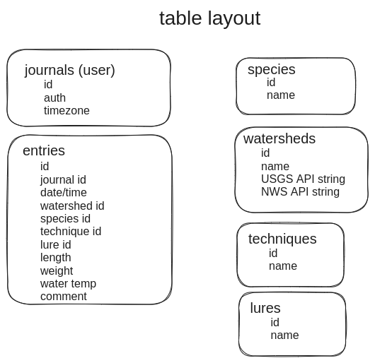
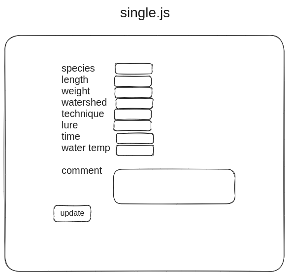

# 
SEIRFX 221 WC Project 2

# Fishing Journal

Leverage weather and water flow information to establish data-driven patterns for success.

To use online, visit: 

---

# HOW TO USE

* Create an account.
* Add journal entries for catches.
    * Species, techniques, and lures are pre-loaded into the database.
    * Create custom species, lures, and techniques to meet your needs.
* Review journal entries to draw conclusions about successful conditions and methods.

---

# SCREENSHOTS

### SPLASH SCREEN


### JOURNAL ENTRIES


### NEW ENTRY


---

# ATTRIBUTION
* USGS Instantaneous Values Web Service: https://waterservices.usgs.gov/rest/IV-Service.html
* Open-Meteo Free Weather API: https://open-meteo.com/
* Background Image by Hunter Brumels: https://unsplash.com/@hbrumels
* Fish images from Wikipedia: https://en.wikipedia.org
* BulmaTemplates: https://github.com/BulmaTemplates/bulma-templates

---

# HOW TO INSTALL
* Requires `Node.js`, `Postgres`, and `Sequelize`
1. `Fork` and `Clone` this repository to your machine.
2. Run `npm install` to install dependencies.
3. Run `sequelize db:create`, `sequelize db:migrate:all`, and `sequelize db:seed:all` to setup database.
3. Run `npm run dev` to start server.
4. Open `http://localhost:3000` in a web browser to access app.

---

# HOW IT WORKS

* Fishing Journal uses the `USGS` API to pole waterflow data from the location of your chosing at the date and time of your catch.
* Using the latitude and longitude of the chosen watershed, Fishing Journal uses `Open-Meteo` to access the weather conditions at that time.
* This data, along with information provided by the user, are stored in a database for future retrieval.


### API CALLS

The main work behind Fishing Journal was to interface HTML form data with the USGS and Open-Meteo API query formats.

To keep the scope of this phase of development manageable, I chose to seed my database with only stream-type USGS gauges in the state of Tennessee.

```javascript
await axios.get('https://waterservices.usgs.gov/nwis/iv/?format=json,1.1&stateCd=TN&siteType=ST&siteStatus=active')
.then(async response => {
// filters the list of stations to only those of water-flow type (in other words, excludes water-depth type)
const flowOnly = response.data.value.timeSeries.filter(station => {
    return station.variable.variableCode[0].value === '00060';
});

const stations = flowOnly.map(station => {
    return {
        siteName: station.sourceInfo.siteName,
        siteCode: station.sourceInfo.siteCode[0].value,
        latitude: station.sourceInfo.geoLocation.geogLocation.latitude.toFixed(2),
        longitude: station.sourceInfo.geoLocation.geogLocation.longitude.toFixed(2),
        timeZone: parseInt(station.sourceInfo.timeZoneInfo.defaultTimeZone.zoneOffset.slice(0,3)),
        createdAt: new Date().toISOString(),
        updatedAt: new Date().toISOString()

    };
});

await queryInterface.bulkInsert('watersheds', stations, {});
```
Here we use the latitude and longitude data from the `USGS` API call to tailor a query string for the `Open-Meteo` API. The result is then used to create an object for `Sequelize` to insert into the database.

```javascript
axios.get(`https://waterservices.usgs.gov/nwis/iv/?format=json,1.1&site=${ws.siteCode}&parameterCd=00060`)
.then(flowRes => {
    let weatherQueryString;

    let weatherDate = moment(req.body.timestamp).format('YYYY-MM-DD');

    const recentQueryHead = `https://`;
    const queryTail = `api.open-meteo.com/v1/forecast?latitude=${ws.latitude}&longitude=${ws.longitude}&start_date=${weatherDate}&end_date=${weatherDate}&hourly=temperature_2m,precipitation,pressure_msl,cloudcover,windspeed_10m,winddirection_10m&daily=temperature_2m_max,temperature_2m_min,precipitation_sum&timezone=auto&temperature_unit=fahrenheit&windspeed_unit=mph&precipitation_unit=inch`;
    
    weatherQueryString = recentQueryHead + queryTail;
...
    axios.get(weatherQueryString)
    .then(weatherRes => {
        const insertEntrie = {...req.body};
        insertEntrie.watershedId = parseInt(insertEntrie.watershedId);
        insertEntrie.specieId = parseInt(insertEntrie.speciesId);
...
        entrie.create(insertEntrie)
        .then(createdEntrie => {
            if(createdEntrie) {
                req.flash('success', `Entry created.`);
                res.redirect('/entries');
            }
        })
    })
})
```

### DATABASE ASSOCIATIONS

Fishing Journal is pre-loaded with default species, techniques, and lures. Users may also create, edit, and delete their own. When one of these items is deleted, it becomes necessary to unset all references to that item in existing journal entries.

```javascript
router.delete('/:id', isLoggedIn, function(req, res) {
    specie.destroy({
        where: {
            id: parseInt(req.params.id)
        }
    })
    .then(numRowsDeleted => {
        if (numRowsDeleted > 0) {
            entrie.update({
                specieId: null
            },{
                where: { specieId: parseInt(req.params.id) }
            })
            .then(numRowsChanged => {
                req.flash('success', `Species deleted.`);
                res.redirect('/species');
            })
            .catch(err => console.log(err));
        } else {
            req.flash('error', 'No species deleted.');
            res.redirect('/species');
        }
    })
    .catch(err => console.log(err));
});
```

---

# FUTURE GOALS

### MAP FUNCTIONALITY
Integrate a map API, which will allow the geographical location for entries to be more flexible, and allow for the use of watersheds that don't have an associated USGS flow gauge.

### WIDER AREA OF COVERAGE
Expand coverage to the entirety of the US, and to stillwater fisheries.

### SEARCH AND FILTER FUNCTIONALITY
Offer a range of search and filter parameters for entries to be easily sorted.

---

# WHITEBOARDS






---

[](https://app.netlify.com/sites/dragonaut/deploys)

